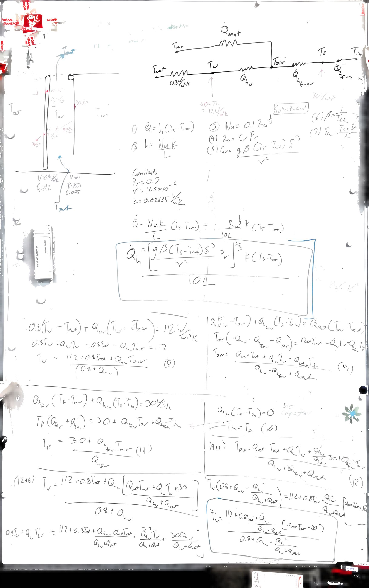

# In Develpment!

# convective_shading
Natural convection algorithm to calculate the performance of an adaptive internal shading/trombe wall system. 

Software uses analytical natural convection equations, combined with a resistive thermodynamic model to evaluate the steady state performance of an internal shading system with exposure to the outside air


Typo in the whiteboard sketch
Q should be h (heat transfer coefficient, not heat transfer)


Software architecture concept

```
- radiation.py
- conection.py
- resistive model.py
- venilation.py
```
`main` runs an itterative steps until solution converges to a steady state value

